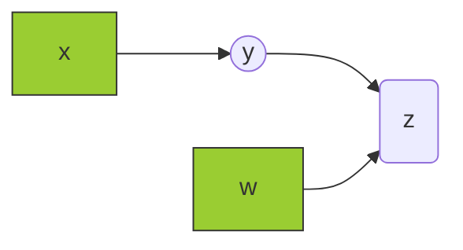
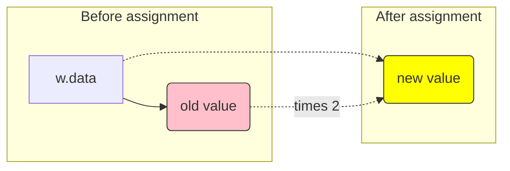
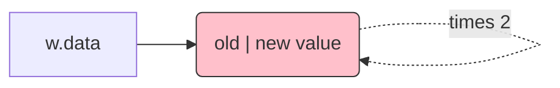

本文简要分析PyTorch`backward`使用中遇到的in-place赋值问题, 以作记录。<!--more-->

<div style="margin: 0 auto;" align="justify" markdown="1">

## 前言

`backward`作为PyTorch的重要函数, 用于自动计算loss对计算图中所有`requires_grad=True`的叶子节点的梯度。日常使用简洁明了, 但偶尔也可能有"奇怪"的需求, 例如在复现[论文](https://papers.nips.cc/paper/6076-learning-values-across-many-orders-of-magnitude.pdf)算法2(Normalized SGD)更新底层网络(**Lower Layers**)参数(${\boldsymbol \theta}$)时。其更新方式定义如下:  

$$
{\boldsymbol \theta} \leftarrow {\boldsymbol \theta} - \alpha \underbrace{ {\boldsymbol J} \left({\color{red} {\boldsymbol \Sigma^{-1} } } {\bf W} \right)^\intercal {\color{red} {\boldsymbol \Sigma^{-1} } } {\boldsymbol \delta} }_ {\text{scaled gradient} }, \label{lower_update}
$$

其中标红部分, 需要对**Target error**(${\boldsymbol \delta} = {\bf W} {\boldsymbol h} + {\boldsymbol b} - Y$)和顶层网络(**Upper Layer**)的参数${\bf W}$进行放缩, 分别乘上${\boldsymbol \Sigma^{-1} }$。但是, 另一方面, 算法还需要对顶层的网络进行更新, 方式如下:  

$$\begin{equation}\label{upper_update}
\begin{aligned}
{\bf W} &\leftarrow {\bf W} - \alpha {\boldsymbol \delta} {\boldsymbol h}^\intercal\\
{\boldsymbol b} &\leftarrow {\boldsymbol b} - \alpha {\boldsymbol \delta}
\end{aligned},
\end{equation}
$$

如果我们将loss定义为$\mathcal{L} \triangleq \left( {\boldsymbol \delta} \right)^2$, 那么`backward`函数所计算出的loss对顶层网络参数的梯度如上述所需, 但对底层网络参数梯度则为:  

$$
\nabla_{ {\boldsymbol \theta} } \mathcal{L} = {\boldsymbol J} {\bf W}^\intercal {\boldsymbol \delta},
$$

这样并未实现$\eqref{lower_update}$中的放缩。为此, 考虑能否**暂时**地将${\bf W}$和${\boldsymbol \delta}$乘上放缩因子, 在执行完$\eqref{lower_update}$中的更新后再将其还原呢? **可以!**

## 简单的例子

为了以上的需求, 我们先从一个简单的例子说起。类似地, 我们构造一个"五脏俱全"的计算图如下:  

<div align="center" markdown="1"> 


</div>

计算规则如下:  

$$
y = x^2, \quad z = wy + 1, \nonumber
$$

其中$x, y, w, z$均为标量。

### 第一步: `backward`小试

<script src="https://gist.github.com/zouyu4524/26d98491444ea896203ab71a8e36f0a3.js?file=pytorch_backward_01.py"></script>

以上代码中`z.backward()`计算了$\partial z / \partial x$和$\partial z / \partial x$, 打印的结果如下:  

```python
tensor([4.])
tensor([1.])
```

$\partial z / \partial x = 2x w = 4$, 而$\partial z / \partial w = y = x^2 = 1$, 不出意外, 这正是"日常"使用`backward`的效果。

### 第二步: 尝试改改`.data`

<script src="https://gist.github.com/zouyu4524/26d98491444ea896203ab71a8e36f0a3.js?file=pytorch_backward_02.py"></script>

这一步中, 试着修改一下`w.data`将其乘以2, 企图得到不同的结果。实际上, 打印的结果如下:  
```python
tensor([4.])
tensor([1.])
```
与上一步中的结果毫无区别。原本预期的结果是该值修改后, 相应计算所得的$\partial z / \partial x = 2x w = 8$, 但并不是。

### 第三步: 试试in-place修改

<script src="https://gist.github.com/zouyu4524/26d98491444ea896203ab71a8e36f0a3.js?file=pytorch_backward_03.py"></script>

这一步与上一步的唯一区别在于对`w.data`修改方式变为了`w.data *= 2`, 即**in-place**赋值方式[^1], 这一概念并非PyTorch专有, 而是程序设计中的通用称呼。这一步所得到的输出如下:  

```python
tensor([8.])
tensor([1.])
```

正是预期的结果。分析两种赋值方式的区别在于:  

```python
w.data = w.data * 2
```

<div align="center" markdown="1">


</div>

如图所示, 实际上开辟了新的内存空间, 计算**新的**`w.data`, 而原本`w.data`所指向的内存地址所存放的结果仍然为原值。

但对于**in-place**的赋值方式则不同: 
```python
w.data *= 2
```

<div align="center" markdown="1">


</div>

如图所示, 在**in-place**赋值下, `w.data`所指向的内存地址不会发生变化, 仅相应地址中的值变化。而这恰恰是实现$\eqref{lower_update}$所需要的。因为, `backward`在计算梯度时, 是通过**原地址**获取相应的数值。如此, 通过**in-place**赋值方式所得到的`w.data`就是修改后预期的结果, 相反第二步中非**in-place**的赋值方式下原地址的值不变, 所以计算梯度时仍然用的原值。

## 小结

* `backward`计算梯度时通过**地址**获取相应的所需的值, 而非**标签**(变量名称, 如`w.data`), 一般情况下这两者相等(标签指向相应的值), 所以看不出差别。  
* **in-place**赋值不新开辟内存空间, 而是在原址上修改值。  
* `tensor.data`可以获取`tensor`中的数据, 且对`tensor.data`操作时不会被`autograd`所记录, 即不会反映到`backward`中。

</div>

[^1]: [What is the recommended way to re-assign/update values in a variable (or tensor)?](https://discuss.pytorch.org/t/what-is-the-recommended-way-to-re-assign-update-values-in-a-variable-or-tensor/6125)