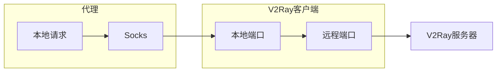

V2Ray是目前最佳的科学上网技术之一。如果你购买了第三方的科学上网服务, 那么本文可能可以帮上你。

<!--more-->

<div style="margin: auto 0;" align="justify" markdown="1"> 

## 前言

目前使用的科学上网技术是V2Ray, 支持Windows/Linux/Mac/iOS/Android等全平台。其核心项目: [v2ray-core](https://github.com/v2ray/v2ray-core), 托管于GitHub。Linux下的客户端可以在其[release](https://github.com/v2ray/v2ray-core/releases)中下载。

我没有自建服务器, 是购买的第三方服务。相应的服务器端的配置信息可在服务提供方的官网上找到。
{: .warning}
此前, 我使用的是ShadowsocksR (SSR)服务, 配置信息比较清晰, 无外乎服务器地址、端口、加密方式、混淆方式, 因此无论在哪个平台配置起来都比较方便。但是V2Ray的配置项目似乎更为复杂, 并且具体的配置信息并没有暴露于我订阅的服务提供方官网中, 仅以二维码或链接的形式给出。而v2ray-core并未提供图形化的配置方式, 但好在配置文件与Windows一致。

## 配置流程

### 一键安装

```bash
sudo su # 获取root权限
bash <(curl -L -s https://install.direct/go.sh)
```
{: .snippet}

* 该脚本由V2Ray官网[^v2ray]提供。

### 配置`config.json`

客户端要能连上服务器必须设置与服务器一致的配置, 并且系统时间与服务器时间差不能超过一分钟。此前在网上直接找到的配置文件与我的服务提供方配置不完全一致, 所以直接借用是无法联通的。这篇文章[^1]中提到了一个巧妙的方法: 

**复制windows下的配置文件到Linux下**。
{: .success}
> Windows下的配置文件为软件根目录下的`config.json`文件。

一键脚本安装下配置文件将位于`/etc/v2ray/config.json`。将windows下对应的同名配置文件内容复制替换Linux下的配置文件内容即可。


### 重启客户端

```bash
sudo service v2ray stop
sudo service v2ray start
```
重启客户端使更新的配置文件生效。

### 设置代理

以上步骤安装并配置好客户端后可以保障与服务器的连接。但要实现科学上网还需要设置代理(socks)。原理是客户端搭建了本机与服务器的链路, 并在本地配置了端口(`127.0.0.1:port`)负责监听请求, 进一步设置了本机的代理即可将请求定向至本地的端口, 从而实现完整的链路通畅。

<div style="margin: 0 auto;" align="center" markdown="1"> 

</div>

</div>

[^1]: [Linux下使用V2ray客户端以及PAC配置](https://www.imcaviare.com/2018-12-18-1/)
[^v2ray]: [Linux 安装脚本](https://www.v2ray.com/chapter_00/install.html#linuxscript)