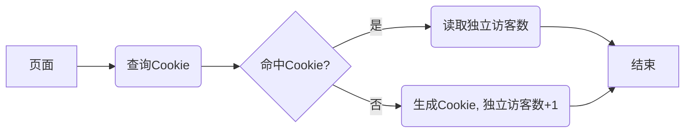

基于TeXt主题中已有的Leancloud访问量统计API, 新增全站访问统计以及独立访客统计。<!--more-->

<div style="margin: 0 auto;" align="justify" markdown="1">

## 前言

TeXt主题中提供了基于Leancloud的页面访问统计功能, 可以方便地统计每篇博客文章的访问量。但是并没有提供统计全站访问量以及独立访客的功能。本文记录实现该功能的过程。

## 已有方案

秉承不重复造轮子的宗旨, 前期查询发现目前常见的PV、UV统计工具是"不蒜子"[^busuanzi], 使用方式非常简单, 为页面引入其提供的js脚本即可。但是该方案存在的问题是无法初始化网页浏览量，这对于有一定访问量的网站并不友好。相应地, 存在一些解决方案, 例如: 通过JS为浏览量加上偏置量[^offset1]<sup>, </sup>[^offset2], 但终归不是一个很完美的方案, 需要添加一些额外的代码。  
除了不蒜子以外, 还有名为[Hit Kounter](https://github.com/zry656565/Hit-Kounter-LC)的开源工具, 这个工具基于leancloud开发, 兼具不蒜子的易用性和相对开放的API, 例如: 提供多个页面浏览量的查询功能。但是, 同样的, 数据初始化功能未实现。  
此外, 这两个工具均是外部工具, 由作者个人维护, 存在服务不可达的风险, 如: 服务器地址更换。

## 需求分析

经过简单的调研发现目前并没有比较符合我预期的PV、UV统计工具。概括我的预期如下:  

- [ ] 全站浏览量统计(PV)
- [ ] 独立访客统计(UV)
- [ ] 数据支持初始化
- [ ] 前端化
- [ ] 尽可能简洁

数据初始化有助于保有前期积累的访问量; 前端化可以保留网站的一体性, 无需操心后端服务。
{: .success}

## 实现方案

为了尽可能简洁, 实现方案确定为调用TeXt主题中提供的[页面统计API](https://github.com/kitian616/jekyll-TeXt-theme/blob/master/_includes/pageview-providers/leancloud/leancloud.js)。

### Leancloud数据存储

[Leancloud](https://www.leancloud.cn/)是一家云服务公司, 提供的数据存储服务, 可将表单数据类似数据库方式存储, 并提供了丰富、完备的API[^lc-api]可供前端调用, 从而省去了后端的开发和维护工作[^TeXt-leancloud]。也正因如此, TeXt主题默认选择了Leancloud作为其页面浏览统计插件[^TeXt]。主题作者在Leancloud提供的API基础上做了进一步的封装, 为单个博客文章提供了便捷的浏览量统计开发接口。

### 文章浏览量统计原理

TeXt主题中, 基于Leancloud的文章浏览量原理如下: 在Leancloud数据存储服务中创建一个Class, Class可以视为数据库的表名称; 当页面被浏览时, TeXt会自动为有设置`key`属性且开启了`pageview`功能的页面在Class表中查找并更新浏览量(如果是首次被浏览, 则创建相应条目); 统计表的结构如下:

```
objectid | ACL | key | title | views | createdAt | updatedAt
```
其中, `key`, `title`以及`views`是自定义的字段, 其他字段为leancloud自动创建字段。

### 全站浏览量统计

根据文章浏览量的原理, 为保持一致性, 可以考虑为该Class多增加一个条目以实现全站浏览量统计: 对任意可纳入浏览量统计的界面置入相应浏览量计数脚本(可在页面模板中加入相应代码), 查找并更新该条目即可。例如: 统计全站浏览量的条目设置如下:  
```
key: whole-site
title: 全站访问
views: 初始值可手动设置为通过站点统计工具(Google analytics或者百度统计)累计的数量
```
**相应地, `views`字段便可在leancloud后台进行手动更改从而实现初始化。**
{: .warning}

### 独立访客统计

独立访客统计可以采用上述相同的实现逻辑, 在同一个Class中创建条目: `key: unique-views, title: 访问用户数`; 主要差别在于如何鉴别独立访客。常用的独立访客鉴别方式是利用cookie技术[^cookie]。通过JS可以在客户端(前端)创建、查询cookie, cookie内容可以是随机生成的用户唯一码, 例如UUID (Universal unique identifier), 如此, 用户多次访问网站的不同页面时可以通过比照客户端cookie判断是否为同一用户。服务器无需记录cookie信息。其流程如下图所示:  

<div style="margin: 0 auto;" align="center" markdown="1"> 

</div>

## 实现细节

### leancloud配置

如果此前配置好了TeXt主题的leancloud相关页面访问统计, 那就很简单了, 只需要在同一个Class下新增两个条目即可, 分别对应全站访问统计和独立访客统计。如果没有配置的话, 可以参看[教程](https://tianqi.name/jekyll-TeXt-theme/docs/zh/configuration#leancloud)进行配置, 在此不赘述。

### 全站访问统计

TeXt提供的页面统计分别考虑了两种页面布局: `home`和`post`, 其中`home`是文章列表页, 而`post`是文章页, 执行逻辑上的差异是`home`需要遍历查询页面列出的文章阅读数, 而`post`需要查询并+1对应的文章阅读数。而全站访问统计功能的逻辑是网站的任意页面点击均记一次阅读, 那么只需要增加如下的代码即可:  
```javascript
pageview.increase('whole-site', '全站访问', function(view) {
  $("#whole-site-views").text(view);
});
```
{: .snippet}
其中`pageview`是已有代码中创建的"计数器", `increase`方法是TeXt提供的API, 顾名思义, 即阅读数+1, 而`whole-site`, `全站访问`是leancloud对应Class中存储全站访问数条目的`key`和`title`; `whole-site-views`是页面中显示全站访问数元素的ID。

### 独立访客统计

上述方案中提到独立访客功能借助cookie技术, 主要涉及三个函数: 查询cookie, 创建cookie以及生成ID。拿来主义, 三个函数分别从网上[^js-cookie]<sup>, </sup>[^uuid]借用。

<script src="https://gist.github.com/zouyu4524/e0418e72a3ca7e19ce24ebd184adb461.js?file=getCookie.js"></script>

`getCookie`根据需要查找的cookie名称`cname`, 查找对应的cookie, 如果没有查询到则返回空字符串。

<script src="https://gist.github.com/zouyu4524/e0418e72a3ca7e19ce24ebd184adb461.js?file=setCookie.js"></script>

`setCookie`创建名称为`cname`, 内容为`cvalue`, 且有效期为`exdays`的cookie。这里可以将`cname`设置为网站域名, 避免与其他网站可能的名称冲突; 对应的内容可以是UUID(实际上也可以为空); 有效期主要控制cookie生存时间, 缺省的情况有效期为`Session`, 即当浏览器关闭时cookie被清除, 这显然不是我们预期的, 目前我设置的是30天。  

以上代码完成了cookie相关的要素, 而流程图中所示逻辑实现如下:  
```javascript
var user = getCookie('be-my-only.xyz');
if ('' == user) {
  setCookie('be-my-only.xyz', uuidv4(), 30);
  pageview.increase('unique-views', '访问用户数', function(view) {
    $("#unique-views").text(view);
  });
} else {
  pageview.get('unique-views', function(view) {
    $("#unique-views").text(view);
  });
}
```
{: .snippet}

### HTML与CSS

以上介绍了功能逻辑的JS实现, 至于这两项数据如何显示就交由HTML与CSS控制。我目前是将这两项数据放置于页面footer中, 效果如图:  

<div style="margin: 0 auto;" align="center" markdown="1">

{: .shadow}
</div>

沿用了fontawesome中的两个图标表示全站访问和独立访客。没有额外的样式控制。

## 参考代码

目前已将上述实现方案部署, 可参考相关commit: [feat: enable pageview for the whole site](https://github.com/zouyu4524/zouyu4524.github.io/commit/9f02cd6b596fcf756367ecfde9a9887fc543ba6b), [feat: add unique views via leancloud and cookie](https://github.com/zouyu4524/zouyu4524.github.io/commit/b157d1f8225216664e7469bff9d3c410639683fe)。考虑以后将这一过程进行提炼与封装, 再为TeXt提一次PR。

## Tips

### Leancloud API

如果你是第一次接触leancloud, 并想对其API做一些了解, 强烈推荐阅读官方文档[^lc-api]。

### Cookie

Cookie以<键, 值>存储于浏览器, 常见的键包括: `Name`, `Value`, `Path`, `Expires`。  

需要注意的是缺省情况下, `Path`为当前页面的路径, 例如: 当前页面URL为: `be-my-only.xyz/blog/page2/index.html`, 则缺省下, 创建的cookie的`Path=/blog/page2/`, 如此将会导致查询时无法找到该cookie(因为默认查询的路径是`/`), 这将导致缺省情况下为每一个不同的路径创建cookie, 因此需要指定`Path="/"`为根目录, 如此, 对与全站的不同页面均对应同一cookie, 保证独立访客的计数逻辑正确。
{: .warning}

### 独立访客

目前我设置的Cookie生存时间为30天, 意味着如果同一个设备在间隔大于30天的情况下访问本站将记作两个独立的访客。此外, 如果用户主动清除cookie, 那再次访问时也同样记为新增独立访客。但总而言之, 这是一个我比较满意的方案, 尤其对于无主机的情况: 后端由leancloud支持, 对于个人站点的访问量, leancloud基本免费; 所有的增、改、查交由前端完成。

</div>

[^busuanzi]: [不蒜子-极简网页计数器](https://busuanzi.ibruce.info/)
[^offset1]: [不蒜子计数器初始化的 Native JS 方法](https://blog.skk.moe/post/busuanzi-offset/)
[^offset2]: [不蒜子计数器初始化的非官方办法](https://liam.page/2017/04/29/busuanzi-offset-setting/)
[^TeXt-leancloud]: [LeanCloud 使用记](https://tianqi.name/blog/2016/10/05/leancloud-use-records.html)
[^TeXt]: [TeXt-网站配置项-文章点击量-Leancloud](https://tianqi.name/jekyll-TeXt-theme/docs/zh/configuration#leancloud)
[^cookie]: [网站统计中的数据收集原理及实现](https://blog.codinglabs.org/articles/how-web-analytics-data-collection-system-work.html)
[^js-cookie]: [JavaScript Cookie](https://www.runoob.com/js/js-cookies.html)
[^uuid]: [Create GUID / UUID in JavaScript?](https://stackoverflow.com/a/2117523/8064227)
[^lc-api]: [数据存储开发指南 · JavaScript](https://leancloud.cn/docs/leanstorage_guide-js.html)