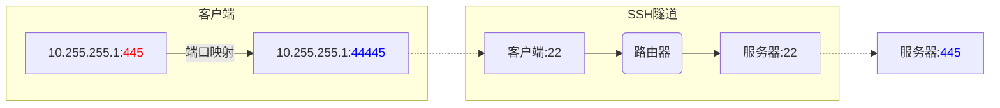

结合Samba与SSH隧道技术实现Windows与CentOS间在**校园网跨网段**环境下共享文件。<!--more-->

<div style="margin: 0 auto;" align="justify" markdown="1">

## 前言

Samba是Linux与Windows间常用的文件共享方案。不同于PuTTY、WinSCP等文件传输工具, Samba的优势在于"共享"。两个系统均可对共享文件夹中的文件进行查看、修改, 例如: 通过Samba在Windows上播放由Linux下载的电影, 省去了拷贝的过程。原本Samba的安装与配置是一个相对简单的过程, 但因校园网环境的缘故, 实现这个功能却着实费了一番周折。

## TL;DR

校园网的路由设备全面封禁了445端口, 而Windows的文件共享服务仅采用445端口传输, 导致跨网段的传输过程无法建立于445端口间的链路。
{: .error}
为此, 需要借助**SSH隧道功能**将传输过程建立于22 (SSH)端口间的链路, 并且在Windows一端, 重定向445端口到任意未占用未被封禁的端口(例如: 44445)。
{: .success}

## 概览

### 名词解释

| 名词 | 角色 |
|:---: |:--- |
| Linux主机 | 服务器, Samba服务安装于此 |
| Windows主机 | 客户机, 通过**映射网络驱动器**连接到Samba服务 |

### 配置流程概述

1. **[Linux主机]** 安装Samba, 配置并启动, 开启对应文件夹的共享服务;
2. **[Windows主机]** 创建**环回适配器**, 并建立端口映射;
3. **[Windows主机]** 配置**SSH隧道**;
4. **[Windows主机]** 添加**网络映射驱动器**, 登录即可。

## Samba安装与配置

Samba提供了用户登录验证的功能, 可以方便地管理不同用户的访问权限。这里我们将创建两个用户以对应两种不同的使用场景:  

- 新建用户, 命名为`frank`, 拥有独立的、新建的共享目录
- Linux已有用户, 名称为`hust`, 并设置已有文件夹为共享目录

> Samba沿用Linux系统的用户和组权限系统, 但有一套独立的授权机制, 简而言之, 其用户密码可与Linux系统用户密码不同[^samba-install]。

### 安装与启动

- 安装`samba`以及`samba-client`, 分别对应samba服务与客户端

```bash
sudo yum install samba samba-client
```
{: .snippet}
- 启动samba服务

```bash
sudo systemctl start smb.service
```
{: .snippet}
- 设置开启自启动

```bash
sudo systemctl enable smb.service
```
{: .snippet}
> 有些教程中同时启用了`nmb.service`, 该服务用于提供NetBIOS功能, 解析计算机名称与IP间的映射关系, 对于动态IP的场景有效, 在此省略。

### 配置防火墙

默认情况下, CentOS防火墙禁用了samba服务, 需要启用相应的防火墙策略。

```bash
firewall-cmd --permanent --zone=public --add-service=samba
firewall-cmd --zone=public --add-service=samba
```
{: .snippet}

### 新建用户与共享文件夹

一般地, 我们可以在根目录下创建文件夹专用于共享, 并创建共享组、共享用户

- 创建共享"分区"

```bash
sudo mkdir /samba
```

- 创建共享组

```bash
sudo groupadd sambashare
```

- 将以上创建的共享"分区"所有权划分至新建的共享组

```bash
sudo chgrp sambashare /samba
```

- 新建共享用户, `frank`

```bash
sudo useradd -M -d /samba/frank -s /usr/sbin/nologin -G sambashare frank
```

其中参数解释如下:  

>- `-M` 不为新建用户创建主目录, 稍后再创建
>- `-d /samba/frank` 设置新建用户的主目录路径
>- `-s /usr/sbin/nologin` 禁用新建用户的shell访问权限
>- `-G sambashare` 设置新建用户的组为上述创建的`sambashare`组

- 创建共享文件夹

```bash
sudo mkdir /samba/frank
sudo chown frank:sambashare /samba/frank
```

以上为新建用户`frank`创建了共享文件夹, 将所有权修改为该用户。

- 设置共享文件夹权限

```bash
sudo chmod 2770 /samba/frank
```

此处设置共享文件夹权限为`2770`, 意味着该用户、该用户所在组其他用户有读、写、执行权限, 组外用户无任何权限。`2`意味着设定了`setgid`位, 可以保障组内任意其他用户在该文件夹下创建的文件可被该用户读、写、执行。
{: .warning}

### 激活用户

以上完成了新用户的创建准备工作, 接下来需要将该用户正式添加到samba中, 并激活以启用。

- 添加用户

```bash
sudo smbpasswd -a frank
```

根据提示设置、确认密码:  

```
New SMB password:
Retype new SMB password:
Added user frank.
```

- 激活用户

```bash
sudo smbpasswd -e frank
```

激活成功显示如下:  

```
Enabled user frank.
```

### 设置SELinux Context

CentOS中默认启用了SELinux工具。该工具是Linux文件权限管理上新增的一层上下文(Context)权限管理, 以杜绝无经验的管理员可能造成的权限错误。简而言之, 只有当对文件的操作与文件所属Context匹配时, 相应的操作才可被执行, 否则将被SELinux阻绝。而Samba共享服务有专有的Context, 即: `samba_share_t`。

```bash
sudo chcon -t samba_share_t /samba/frank
```

### 设置已有文件夹为共享

上述流程创建了一个新的组和用户, 并为该用户创建了共享文件夹; 但实际使用中, 可能需要将已有文件夹设置为共享。假设该文件夹为: `/home/hust/Videos`, 文件夹的所有者为用户`hust`。那么操作方式如下:  

- 添加用户至samba中

```bash
sudo smbpasswd -a hust
```

设置密码, 注意这里的密码可与Linux账户`hust`密码不一致。
{: .warning}

- 启用该用户

```bash
sudo smbpasswd -e hust
```

- 修改SELinux Context

```
sudo chcon -Rt samba_share_t /home/hust/Videos
```

> 注意其中采用了`-R`参数, 递归设置, 将该目录下的所有Context均设置为`samba_share_t`。

### 配置Samba共享目录

samba配置文件位于: `/etc/samba/smb.conf`, 以管理员权限打开后, 在文件末尾添加内容如下:  

```bash
[frank]
    path = /samba/frank
    read only = no
    force create mode = 0660
    force directory mode = 2770
    valid users = frank

[videos]
    path = /home/hust/Videos
    browseable = no
    read only = no
    force create mode = 0660
    force directory mode = 2770
    valid users = hust
```
{: .snippet}

以上配置内容表示新增两个共享目录, 分别是`frank`以及`videos`, 对应的路径由`path`指定, 有访问权限的用户由`valid users`指定。以上表示: `/samba/frank`只能由用户`frank`访问, 而`/home/hust/Videos`只能由用户`hust`访问。  
其他的参数定义如下:  

>- `browseable` 该目录是否可以被其他用户列出。
>- `read only` 由`valid users`指定的用户是否可以写入该目录
>- `force create mode` 设置新建文件的权限
>- `force directory mode` 设置新建文件夹的权限

### 小结

以上, Samba服务端的配置全部完成。小结如下:   

<div style="margin: 0 auto;" align="center" markdown="1"> 

</div>

能访问到共享文件需要"闯"三关, 分别是:  

1. samba账户权限: 登录
2. SELinux安全策略: Context匹配
3. Linux文件系统权限: 文件权限


## 连接Samba服务

### Linux主机

- 安装samba客户端

此前以通过`yum install samba-client`在CentOS上安装了客户端, Ubuntu和Debian系统通过如下命令安装:  
```bash
sudo apt install smbclient
```

- 连接服务器

语法如下:
```bash
smbclient //samba_host_ip/share_name -U username
```
示例如下:  
```bash
smbclient //127.0.0.1/videos -U hust
```
以上命令以用户`hust`身份连接本机Samba服务器的`videos`文件夹, 按照提示键入用户`hust`的samba账户密码即可登录。登录成功, 将显示如下内容:  

```bash
Try "help" to get a list of possible commands.
smb: \>
```
除此以外, 还可以通过[图形化界面](https://linuxize.com/post/how-to-install-and-configure-samba-on-centos-7/#using-gui)的方式登录, 在此不再赘述。

### Windows主机

以上, 我们搭好了Samba服务, 并通过Linux主机在本机上验证了可以正常连接至Samba服务器。而在Windows上的配置着实折腾了我很久, 根本在于此前没有弄清楚无法连接的原因。后来证实应该是由于校园网路由设备为防范"比特币"病毒封禁了445端口[^445]造成链路不通, 并非Samba配置的问题。由于我的Windows主机与Linux主机分别位于校园网的不同网段, 连通时将跨越校园网的路由设备, 导致经由445端口的数据无法走通, 如下图所示。

<div style="margin: 0 auto;" align="center" markdown="1">


</div>

这个问题在局域网一般不存在, 因为局域网中客户端与服务器仅通过家用路由器连接, 一般是不会封禁端口。
{: .warning}
明确问题后, 解决方案就有了: 通过SSH隧道技术为客户端与服务器间搭建SSH链路(走22端口), 并在客户机建立端口映射, 网络链路如图所示:  

<div style="margin: 0 auto;" align="center" markdown="1">


</div>
> 其中点线表示**隧道**。`10.255.255.1`为客户端的环回适配器IP地址, 具体配置流程将在下节给出。

如此, 在校园网路由设备的视角下, 客户端与服务器间的链路是经由端口22建立的, 因此可以顺利连通。
{: .success}

## 搭建SSH隧道绕开445端口限制

### 步骤一览

1. 安装环回适配器
2. 配置环回适配器
3. 禁用SMB1.0功能
4. 修改`LanmanServer`服务启动方式
5. 配置端口映射
6. 重启与验证
7. 配置PuTTY

详细配置流程可以参考[这里](https://www.nikhef.nl/~janjust/CifsOverSSH/Win10Loopback.html), 在此仅概况步骤中的注意事项。
{: .warning}

### 配置环回适配器

环回适配器是Windows上的虚拟网卡功能, 在此我们需要安装一个, 并设置其IPV4地址为: `10.255.255.1`, 子网掩码为`255.255.255.0`, 网关留白。(IP地址也可以是其他与实际网卡采用的网卡不同网段的地址。)其他环回适配器的设置还包括:  

- **取消**Microsoft网络客户端功能、网络和打印机共享功能
- **启用**Internet协议版本4
- IPV4协议中配置接口跃点数为9999
- IPV4协议设置的WINS标签页下禁用NetBIOS

<div class="grid-container">
<div class="grid grid--px-1">
  <div class="cell cell--4" style="margin: 0 auto;"></div>
  <div class="cell cell--4" style="margin: 0 auto;"></div>
  <div class="cell cell--4" style="margin: 0 auto;"></div>
</div>
</div>

### 修改`LanmanServer`启动方式

> Now we first need to tweak a Windows system driver to overcome the thing that Microsoft broke. The root cause of the problem is that we need to access the file share using TCP port **445**. However, when Windows 10 boots this port is grabbed by the system `lanmanserver` driver for all interfaces. By delaying the startup of the lanmanserver driver and by installing a portproxy rule we can circumvent this[^overssh].

这里给出了修改`LanmanServer`服务启动方式的原因: 默认情况下, `lanmanserver`(在**服务**中的名称为`Server`)随系统启动, 并且会占用所有网卡的445端口(包括我们刚刚新建的虚拟网卡)。为此, 我们需要将该服务延迟启动, 并且将新建环回适配器的445端口映射至一个其他的端口。
{: .warning}

可以在服务中查找定位到`Server`, 修改启动方式为: **自动(延迟启动)**, 或者以管理员权限通过cmd执行以下命令:  

```
sc config lanmanserver start= delayed-auto
```
> *注意`start=`后有一个空格。*

经我的实测发现, 同样的道理还需要设置另一个服务: `LanmanWorkstation`(**服务**中的名称为`Workstation`)。该服务不能设置延迟启动, 只能设置为手动启动。
{: .error}

### 配置端口映射

> 为保障端口映射能在开机时启用, 需要确保`Iphlpsvc`(服务中的名称为`IP Helper`)开机启动, 即启动方式为: **自动**。

将环回适配器的**445**端口映射至另一端口, 例如: **44445**。操作如下:

```
netsh interface portproxy add v4tov4 listenaddress=10.255.255.1 listenport=445 connectaddress=10.255.255.1 connectport=44445
```

### 重启与验证

为使以上配置生效, 重启计算机。通过如下命令进行验证:
```
netstat -an | find ":445 "
```
<div style="margin: 0 auto;" align="center">

</div>

如果配置成功的话, 应该会如图所示, 有一条`10.255.255.1:445`的记录。

### 配置PuTTY

以上的步骤已经完成了所有的准备工作, 最后, 只需要再配置好PuTTY即可完成SSH隧道的连通。如图所示: 在PuTTY的**Connection**<kbd>→</kbd>**SSH**<kbd>→</kbd>**Tunnels**标签页下完成配置, 分别在Source Port、Destination填入:

- `10.255.255.1:44445`, 即本机环回适配器的IP地址以及上述设定的**非445**端口
- `Samba服务器IP:445`, 即服务端IP地址以及445端口

**完成填写后, 点击`Add`使规则生效。**然后回到**Session**标签页, 填入Host IP地址, 点击**Open**即可开启SSH隧道。

<div style="margin: 0 auto;" align="center">

</div>

## Windows连接Samba服务器

最后, 在SSH隧道搭建完毕的基础上, 我们可以在跨网段且445端口被封禁的网络环境下从Windows连接Samba服务器了。

### 连接步骤

- 点击**此电脑**, 选择**映射网络驱动器**
<div style="margin: 0 auto;" align="center">

</div>
- 选择磁盘编号, 填写共享文件夹地址`\\10.255.255.1\videos`, 勾选**使用其他凭据连接**
<div style="margin: 0 auto;" align="center">

</div>
- 键入Samba用户名与密码
<div style="margin: 0 auto;" align="center">

</div>
- 完成连接
<div style="margin: 0 auto;" align="center">

</div>

### 其他方式

除此以外, 还可以通过**添加一个网络位置**进行添加, 流程与上述类似, 在此不再赘述。

### 工作组

网络上查询发现有若干教程提到Samba服务器配置时要保持和Windows下的用户所在工作组一致, 否则无法访问。实际操作发现并不存在这个问题。


</div>

[^samba-install]: [How to Install and Configure Samba on CentOS 7](https://linuxize.com/post/how-to-install-and-configure-samba-on-centos-7)
[^setgid]: [第七章、Linux 文件与目录管理](http://cn.linux.vbird.org/linux_basic/0220filemanager_7.php)
[^445]: [“比特币病毒”劫持部分国内高校网络 在汉院校目前未受侵袭](http://hb.people.com.cn/n2/2017/0514/c192237-30177871.html)
[^overssh]: [Mounting your Nikhef home directory using SSH for Windows 10](https://www.nikhef.nl/~janjust/CifsOverSSH/Win10Loopback.html)