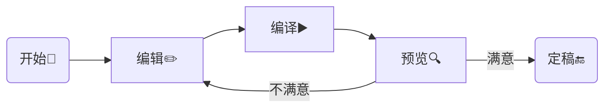

从WinEdt到TeXStudio再到VS Code, "终于找到你"。<!--more-->

## 前言

科研论文写作, 尤其是工科论文, LaTeX环境搭建是第一步。不同于Word的所见即所得, LaTeX门槛相对较高, 尤其是许多相关的术语或词汇: LaTeX, MiKTeX, TeXlive, CTeX, pdflatex, xelatex, TeXStudio, WinEdt等等, 很容易让入门的用户感到困惑。LaTeX语法有关的教程非常丰富, 例如: 《一份不太简短的$\LaTeX2\varepsilon$介绍》[^lshort]。本文不涉及LaTeX语法内容, 主要旨在厘清这些概念间的关系, 并且给出推荐的LaTeX环境搭建方案。

## TL;DR

推荐的LaTeX写作方案: MiKTeX 或 TeXlive + VSCode + LaTeX Workshop
{: .success}

## LaTeX写作流程

用LaTeX写文章的一般流程如下图所示: 

Word之所以"所见即所得",是因为用户对"编译▶️"环节是无感的, 而这一环节恰恰是LaTeX的特点。实现"编辑"、"编译"以及"预览"三个环节的工具分别是: 编辑器、编译器(排版引擎)以及PDF(DVI)文档阅读器, 前言中提到的若干概念就是这三类工具的具体实现方案, 具体分类如下:

| 类别 | 术语或词汇 |
| :---: | :--- |
| 编辑器 | WinEdt, TeXStudio, VSCode |
| 编译器 | latex, pdflatex, xelatex |
| PDF(DVI)文档阅读器 | Sumatra PDF, Adobe Reader, Yap viewer |

除此以外, MiKTeX, TeXlive以及CTeX被称为LaTeX发行版, 是对多种编译器、文档阅读器、LaTeX常用宏包(packages)以及宏包管理工具的打包。下面将简要介绍这几个发行版和编辑器。

## LaTeX发行版

### CTeX

这是我用的第一个LaTeX发行版(更应该称其为"套装"), 在安装的时候我还不了解LaTeX相关的概念, 但并不妨碍使用。因为CTeX[^ctex]做到了足够的"傻瓜式"操作, 其安装程序包括了编辑器: WinEdt, 各类编译器: latex, pdflatex, xelatex等以及文档阅读工具: Sumatra PDF, 一应俱全, 并且完整版安装基本囊括了所有可能用到的LaTeX宏包。但其"包全"的方式也恰恰某程度上阻碍了用户对LaTeX排版系统的了解。更为关键的是, 其更新目前处于停滞状态, 某些功能已无法满足当前需求, 如`latexmk`版本陈旧。[这篇文章](https://zhuanlan.zhihu.com/p/45174503)对CTeX的分析很全面。结论是, **目前不再推荐使用CTeX套装**。

### MiKTeX

MiKTeX是主流的LaTeX发行版之一, 编译器齐全, 宏包管理功能方便直观, 更新迭代即时。**该发行版适合于Windows系统。**

### TeXlive

同样的, TeXlive是另一款主流的LaTeX发行版, 具备MiKTeX一样的优点。与MiKTeX略有不同之处在于, 其更新策略为每年一个大版本迭代, 版本号以年份标注。**该发行版更适合于类Unix系统**, 即: Linux与Mac系统(Mac系统更推荐MacTeX, 其内核仍是TeXlive)。

### 对比

这篇文章[^compare]给出了MiKTeX和TeXlive的对比, 值得一看。大体上, 这两个发行版都是非常优秀的跨平台发行版。

## 编辑器

编辑器是写作的窗口, 一款好的编辑器能大大提升写作的效率。对编辑器的需求主要是醒目的语法高亮、好看的颜色主题、关键词自动补全、拼写检查等, 而作为LaTeX的编辑器, 还包括: 文献索引、引用(图表、公式)速查。入门之初, 由于使用的CTeX套装, 编辑器为WinEdt, 傻瓜式操作, 开箱即用, 功能也比较齐全, 但颜色主题比较单一。而后分别尝试过TeXStudio, VSCode。目前最为满意的编辑器是VSCode。

### TeXStudio

TeXStudio作为一个专用的LaTeX编辑器, 其体验非常好, 也基本是傻瓜式操作, 并且可以集成Language Tool工具, 进行语法检查; 颜色主题也可以自定义。有关TeXStudio的配置可以参考[这里](https://be-my-only.xyz/blog/texstudio-settings/)。

### VSCode

VSCode以其丰富的插件市场笼络了大批程序员, 基本上VSCode+"某"插件就可以成为"某"语言的IDE, LaTeX也不例外。这里的"某"插件就是[LaTeX Workshop](https://marketplace.visualstudio.com/items?itemName=James-Yu.latex-workshop)。这个方案具备以上所列举的各项功能, 尤其颜色主题的一体性非常好, 不同于TeXStudio的颜色主题仅限于编辑区, VSCode的颜色主题应用于编辑器整体, 包括功能区。此外, LaTeX Workshop支持公式预览, 增量式编译(`latexmk`)等功能, 为编译省去不少时间。正、反向跳转功能无需配置, 方便文章修改。

如果此前安装过CTeX套装, 那么使用VSCode+LaTeX Workshop的方案极有可能不成功, 其原因在于LaTeX Workshop默认的`latexmk`编译器所需要的版本超过了CTeX套装所提供的版本。
{: .error}

## 其他

### eps查看

论文中插图一般为eps格式, 在类Unix系统下, eps图片的查看工具完善, 而在Windows下需要借助额外的工具: Ghostscript+GSview。其中Ghostscript是内核, GSview是GUI, 这一套也是包含在CTeX套装中的。在不使用CTeX套装的情况下, 可以自行下载安装。需要注意的是:

GSview和Ghostscript的安装均是全局式的, 而LaTeX发行版中同样提供了Ghostscript的功能, 为避免冲突, 可以选择全局安装GSview, 而后解压缩Ghostscript的安装包, 并将其组件放置于GSview的安装路径下[^gsview], 即可将查看eps图片时调用的Ghostscript与LaTeX编译eps文件时调用的Ghostscript隔离。具体操作参看下节。
{: .warning}

> Windows系统下eps图片查看工具还有EPSViewer, Inkscape等, 但要么太简陋, 要么太复杂, 我最满意的方案还是Ghostscript+GSview。

### 安装GSview

GSview轻量, 启动快, 虽然不再更新了[^update], 但GSview 5.0版足够好用。在官网下载exe文件安装即可, 首次启动可能会提示需要下载Ghostscript, 可以跳过该环节。

而后, 前往Ghostscript官网下载[安装包](https://www.ghostscript.com/download/gsdnld.html), 选择GPL版本即可。下载后, 无需双击安装, 利用解压工具解包, 将`bin`文件夹更名为`gs`, 并将`lib`目录下的所有文件拷贝至`gs`目录下即具备了Ghostscript的standalone文件, 可将`gs`拷贝至GSview所在的路径。

随着Ghostscript的更新迭代, 目前最新的版本(>=9.53)已不再被GSview识别支持。 可以在其repo中找到可支持的最新版本([9.52](https://github.com/ArtifexSoftware/ghostpdl-downloads/releases/download/gs952/gs952w64.exe)), 我这里也提供一个[备份](https://res.be-my-only.xyz/gs952w64.exe)。
{: .error}

接下来, 在GSview中配置Ghostscript动态链接库(DLL)以及`include Path`即可(如下图所示, 其中`gs`目录的路径为`D:\Ghostgum\gs`), GSview<kbd>→</kbd>Options<kbd>→</kbd>Advanced Configure...

[^lshort]: [The Not So Short Introduction To LaTeX (Chinese Edition)](https://github.com/CTeX-org/lshort-zh-cn/releases)
[^ctex]: [CTEX : HomePage](http://www.ctex.org/HomePage)
[^compare]: [TeX on Windows: TeX Live versus MiKTeX revisited](https://www.texdev.net/2016/12/18/tex-on-windows-tex-live-versus-miktex-revisited/)
[^gsview]: [IMPORT EPS IN INKSCAPE ON WINDOWS \| Open File Tutorial](https://www.youtube.com/watch?v=iRKTtTw65hw)
[^update]: [GSview 5.0](http://www.ghostgum.com.au/software/gsview.htm)