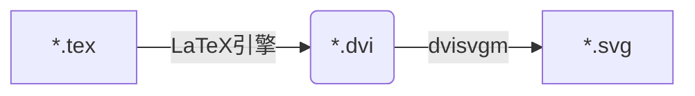

${\rm \LaTeX}$环境整理"后遗症": Readme2TeX不能用了。本文记录本次debug过程。<!--more-->

<div style="margin: 0 auto;" align="justify" markdown="1">

## 前言

[Readme2TeX](https://github.com/leegao/readme2tex)是由Lee Gao编写的一款python模块, 可使GitHub的Readme支持${\rm \LaTeX}$渲染。具体的用法可以参见其[repo](https://github.com/leegao/readme2tex)或参考[这里](/blog/readme2tex/)。时隔有段时间后发现该工具不可用, 而这期间的变化是**卸载了CTeX套装, 改装了MiKTeX**。

## 错误定位

使用该工具的错误提示如下:

```
(readme2tex) D:\Github>python -m readme2tex --nocdn --output README.md READOTHER.md
Traceback (most recent call last):
  File "C:\Users\yuze\Anaconda3\envs\readme2tex\lib\runpy.py", line 193, in _run_module_as_main
    "__main__", mod_spec)
  File "C:\Users\yuze\Anaconda3\envs\readme2tex\lib\runpy.py", line 85, in _run_code
    exec(code, run_globals)
  File "C:\Users\yuze\Anaconda3\envs\readme2tex\lib\site-packages\readme2tex\__main__.py", line 162, in <module>
    args.bustcache)
  File "C:\Users\yuze\Anaconda3\envs\readme2tex\lib\site-packages\readme2tex\render.py", line 177, in render
    xml = (ET.fromstring(svg))
  File "C:\Users\yuze\Anaconda3\envs\readme2tex\lib\xml\etree\ElementTree.py", line 1315, in XML
    return parser.close()
xml.etree.ElementTree.ParseError: no element found: line 1, column 0
```

通过调试, 定位到错误发生的关键点在于`render.py`177行, 即: `xml = (ET.fromstring(svg))`, 而上下文代码如下:

```python
svg, dvi, name = rendertex(engine, equation, packages, temp_dir, block)
svg = svg.decode('utf-8')

xml = (ET.fromstring(svg))
```

由于`svg`为空字符, 导致了后续错误, 而造成`svg`为空字符的原因在于`rendertex`函数中的这一部分:

```python
dvi = os.path.join(temp_dir, name + '.dvi')
svg = check_output(
    ['dvisvgm', '-v0', '-a', '-n', '-s', dvi])
return svg, dvi, name
```

此处通过`check_output`函数调用了外部指令并捕获指令执行的输出结果传递给变量`svg`, 该外部指令如下:

```
dvisvgm -v0 -a -n -s [dvi]
```

通过查看`dvisvgm`的用法, 此处`-v0`设置`verbose`等级为`0`, 导致报错信息被隐藏, 设置`-v1`后, 会提示如下的错误信息:

```
ERROR: MiKTeX session could not be initialized
```

Google该错误提醒查询到如下解释[^dvisvgm1]<sup>, </sup>[^dvisvgm2]:

> dvisvgm needs access to the MiKTeX COM interface which seems not to be available on my system -- probably because I installed miktex as single user without admin rights.

错误原因在于dvisvgm会调用MiKTeX的COM接口, 而由于此前卸载了CTeX, 改装了MiKTeX未赋予其管理员权限导致dvisvgm无法调用。解决方案为[^dvisvgm2]<sup>, </sup>[^dvisvgm3]: 以管理员权限在cmd中执行如下指令:

```d
mpm --register-components --verbose
```

### 小结

Readme2TeX的执行流程如下: 

<div style="margin: 0 auto;" align="center" markdown="1">



</div>

错误出在`dvi->svg`这一环, 注册MiKTeX组件使dvisvgm可以调用即可。
{: .warning}

## 调试Python module

分别通过PyCharm和VSCode进行调试。两者的module调试功能都比较直观。

### PyCharm

PyCharm的module调试步骤如下:

Run ➡ Edit Configurations... ➡ 点击"+" ➡ 选择Python ➡ "**Script path:**"下拉修改为"**Module name**" ➡ 填入需要调试的module名称 ➡ **Parameters**键入执行module需要的参数(如果有) ➡ 选择**Working directory**(如果有文件交互) ➡ Apply ➡ OK
{: .success}

*图1: PyCharm 调试Python Module*
{: .shadow.rounded}

### VSCode

目前VSCode对Python的支持已经相当完善, 有了官方Python插件加持, VSCode是一款优异的Python IDE。不同于PyCharm提供的GUI界面, VSCode的调试通过创建`launch.json`进行配置, 同样直观, 其配置文件类似如下:

```json
{
    "version": "0.2.0",
    "configurations": [
        {
            "name": "Python: 模块",
            "type": "python",
            "request": "launch",
            "module": "readme2tex",
            "args": ["--nocdn", "--rerender",  "--usepackage", "tikz", "--output", "README.md", "READOTHER.md"]
        }
    ]
}
```

其中, `args`负责配置执行module需要添加的参数, 将命令行以空格分隔的参数, 逐一填入字符串list即可。
{: .warning}

*图2: VSCode 调试Python Module*
{: .shadow.rounded}

## Tips

调试module时需要注意Python项目的**根目录**选择(即: `.idea`或`.vscode`所在目录)。以`readme2tex`为例, 其repo目录结构如下, 其中`readme2tex`模块的主体为**子级**`readme2tex`。因此在调试该module时, 需要将根目录设置为**父级**`readme2tex`, 如此, IDE才可以识别到需要调试的module。

```
📦readme2tex        # 父级
 ┣ 📂readme2tex     # 子级
 ┃ ┣ 📜render.py
 ┃ ┣ 📜__init__.py
 ┃ ┗ 📜__main__.py
 ┗ ...
```

</div>

[^dvisvgm1]: [What does the error MiKTeX session could not be initialized mean?](https://dvisvgm.de/FAQ/)
[^dvisvgm2]: [#2376 MiKTeX session object missing in single user installations?](https://sourceforge.net/p/miktex/bugs/2376/)
[^dvisvgm3]: [五、MiKTex \| 动画库manim\[3b1b\]的安装与配置](https://www.bilibili.com/read/cv416707/)